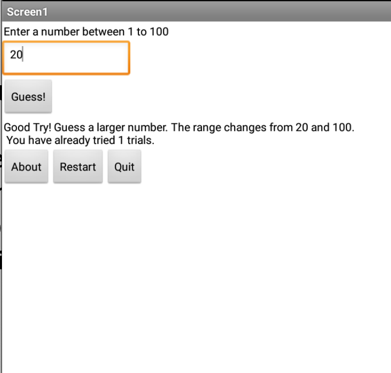
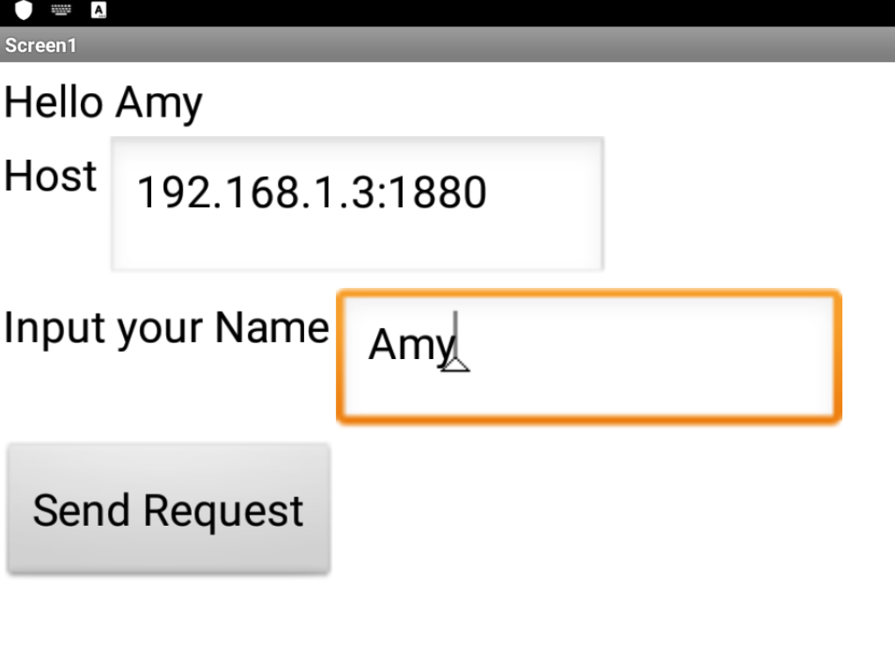
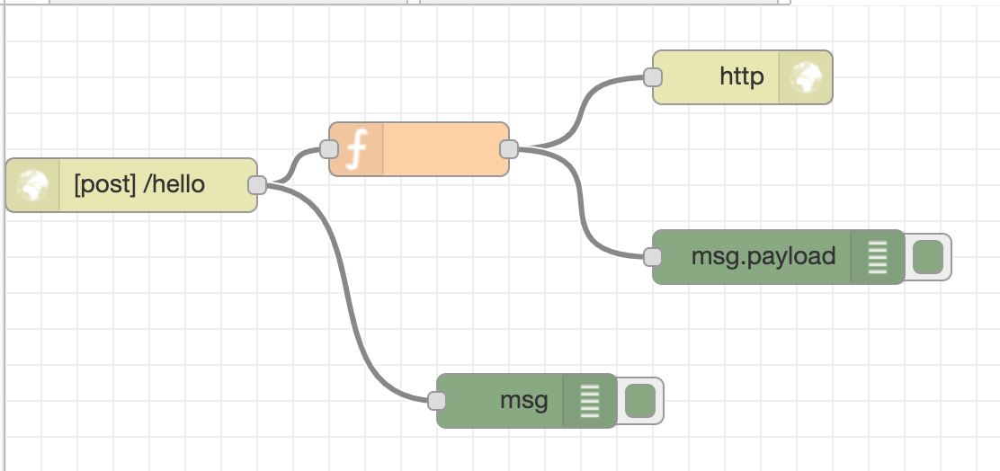

# LAB1

## LAB1_GuessTheNumber.aia

## 目標

隨機生成一個1~100之間的整數，讓使用者透過textbox輸入要猜測的數字，並且提示遊戲進度，並不斷修正猜測範圍。

## 步驟

1. 先依據 `Lab 1.pdf` 的範例步驟執行
    1. 介面
    2. 運算邏輯
2. 完成 TASKS 的需求
    1. 依據使用者輸入狀況，調整適合範圍
3. 使用 Bluestack 測試
4. 意外處理
5. 微調版面，字串

## LAB1_HttpPostApplication.aia

## 目標 - App-side

將textbox中的文字，經由HTTP POST的方式傳到自己定義的node-red server，並將回傳的response放置到畫面上。

## 步驟 - App-side

1. 先依據 `Lab 1.pdf` 的範例步驟執行
    1. 介面
    2. 運算邏輯
2. 完成 TASKS 的需求
3. 使用 Bluestack 測試
4. 微調版面
5. 優化
   1. Host server 可被參數化

## LAB1_flows.json

## 目標 - node-side

1. 接受來自app的訊息，並回覆response
2. 將使用者的傳送的名稱前加上 `Hello` 並回傳

## 步驟 - node-side

1. 完成 `POST` endpoint
2. 使用 `curl` 進行測試，檢查 node-red 的 debug messages

```bash
curl -X POST 192.168.1.3:1880/hello --data "name=Amy"
```

## 心得

1. 字串最好預先規劃，包括空格，並可接受換行符號 (`\n`)

## 呈現

GuessTheNumber


HttpPostApplication


Node-Red
