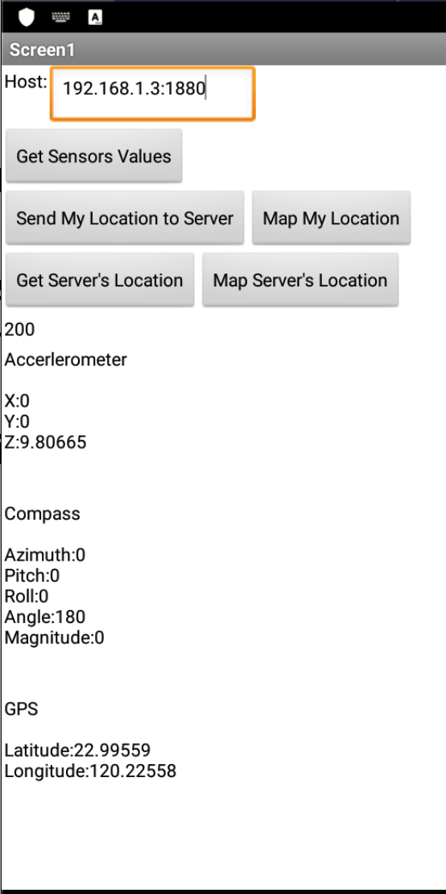
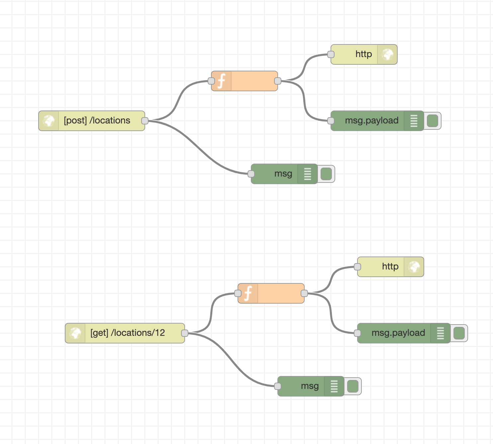

# LAB2

## LAB2_GetSensorValue.aia

備註：已經把所有目標完成在同一份 Project 上 (`GetSensorValue.aia`) 。

## 目標 - App-side

1. 按下按鈕，顯示手機上的三種sensor，Accelerometer、OrientationSensor、LocationSensor的資料
2. 即時更新三種 sensor
3. 將手機 location 的值傳到 node-red 顯示
4. 讀取 server 的 location 資料
5. 將 3. & 4. 中的 location 資料用google map定位

## 步驟 - App-side

1. 先依據 `Lab 2.pdf` 的範例步驟執行
    1. 介面
    2. 運算邏輯
2. 完成 TASKS 的需求
3. 使用 Bluestack 測試
   1. 設定 emulator 的地理位置
   2. 按照目標進行測試
4. 微調版面
5. 優化
   1. 將 Host 改成 TextBox，讓使用者輸入

## LAB2_flows.json

## 目標 - node-side

1. 接受來自app的訊息，並回覆response
2. 回傳在server儲存的location data

## 步驟 - node-side

1. 完成 `POST` endpoint
2. 使用 `curl` 進行測試，檢查 node-red 的 debug messages

```bash
curl -X POST 192.168.1.3:1880/locations \
     --data "groupid=12&longitude=34&latitude=56"
```

3. 完成 `GET` endpoint
4. 使用 `curl` 進行測試，檢查 node-red 的 debug messages

```bash
curl -X GET 192.168.1.3:1880/locations/12
```

## 心得

1. Sizing 可使用 `Responsive`，方便顯示在不同尺寸的介面

## 呈現

介面



Node-Red


