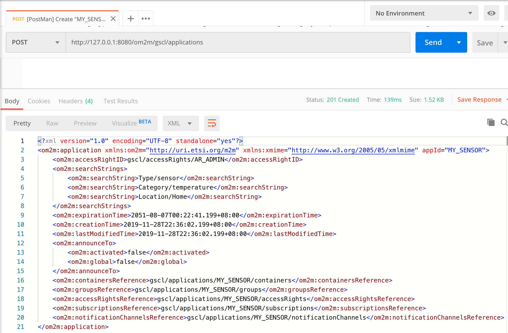
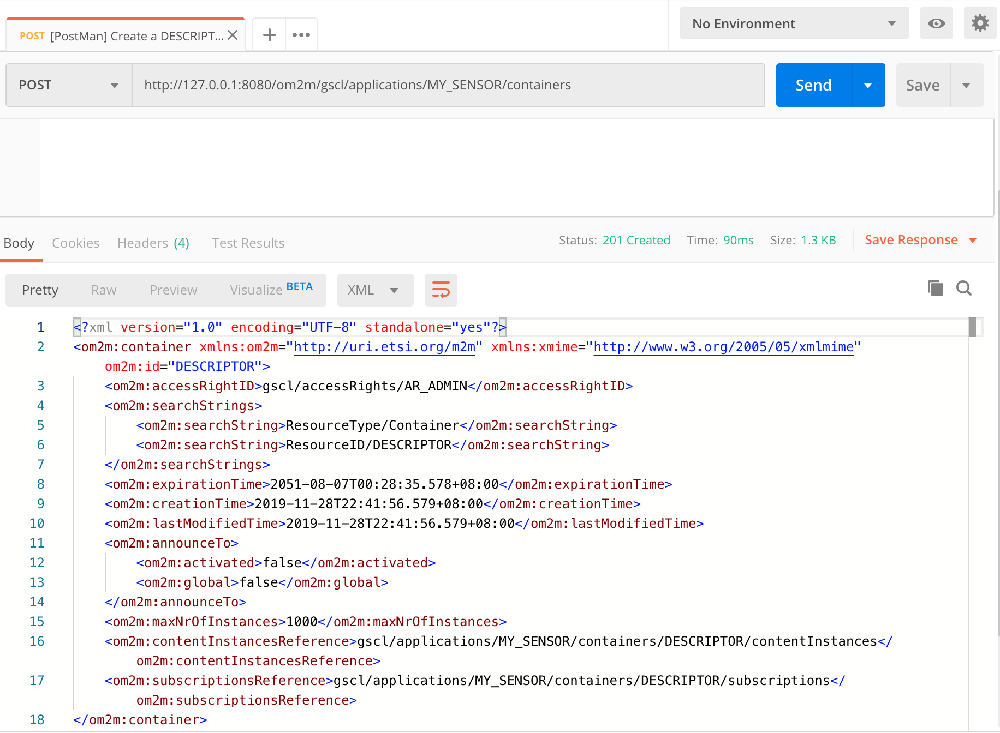
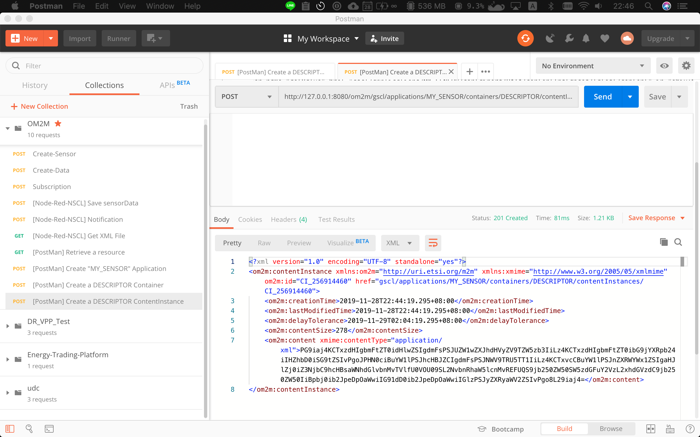
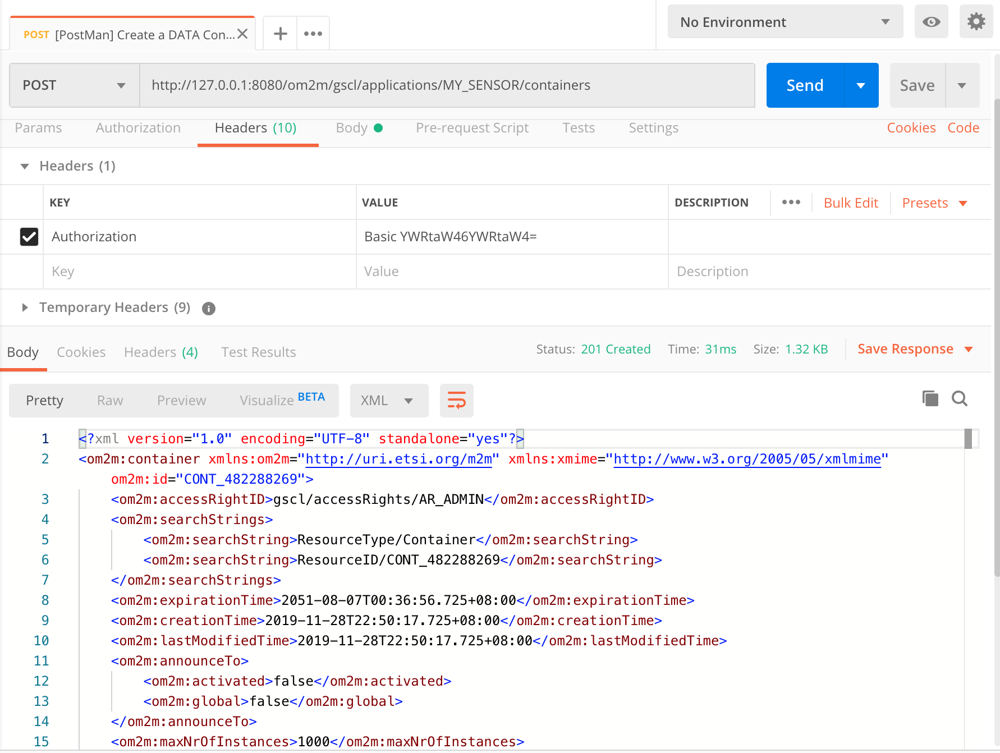
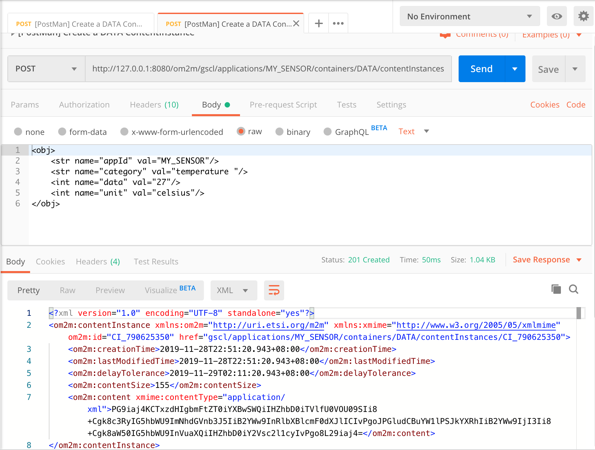
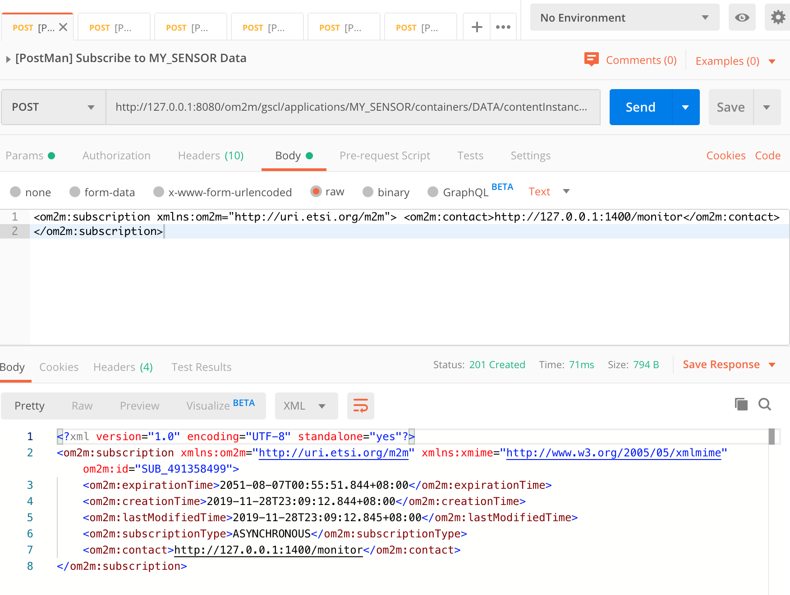
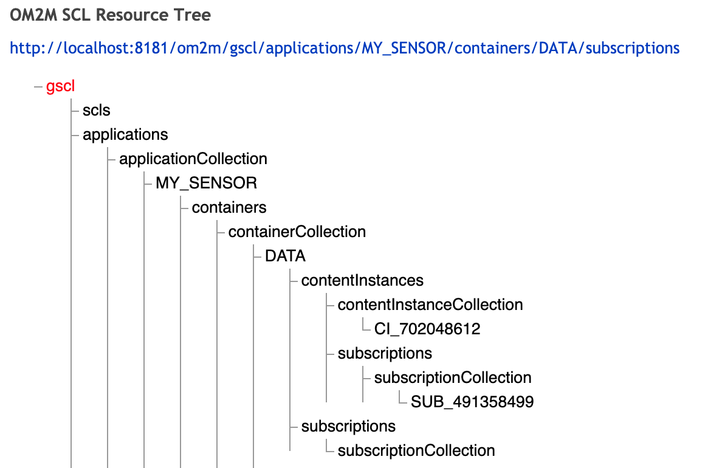

# LAB3

## LAB3_OM2M with Postman

## Postman - 目標

使用Postman分別建立以下Entities:

1. Create a "MY_SENSOR" Application

2. Create a "DESCRIPTOR" container

3. Create a "DESCRIPTOR contentInsances"

4. Create a "DATA" container

5. Create a "DATA contentInsances"

6. Create a "Subscription" contact to localhost:1400/monitor

## Postman - 作法

1. 依據 `Lab 3.pdf` 執行

## Postman - 完成畫面

## LAB3_OM2M GA with Node-red

## GA - 目標

使用 node-red 在GSCL分別建立以下 Entities:

1. Create a "MY_SENSOR" Application
2. Create a "DESCRIPTOR" container
3. Create a "DESCRIPTOR contentInsances"
4. Create a "DATA" container
5. Create a "DATA contentInsances"
6. 在 GA(node-red) 開啟 /sensorData Server 負責轉傳 data 到 OM2M

## GA - 作法

1. 依據 `Lab 3.pdf` 執行

## LAB3_OM2M NA with Node-red

## NA - 目標

使用 node-red 在 NSCL 分別建立以下 Entities:

1. Create a "MY_NETWORK_APPLICATION"
2. Subscribe and save new contentInsatnace in the `gscl/MYSENSOR/DATA`
3. 開啟 /getxmlfile Server 負責讀取先前儲存的資料

## NA - 作法

1. 依據 `Lab 3.pdf` 執行
