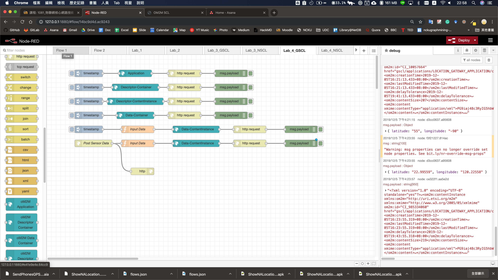
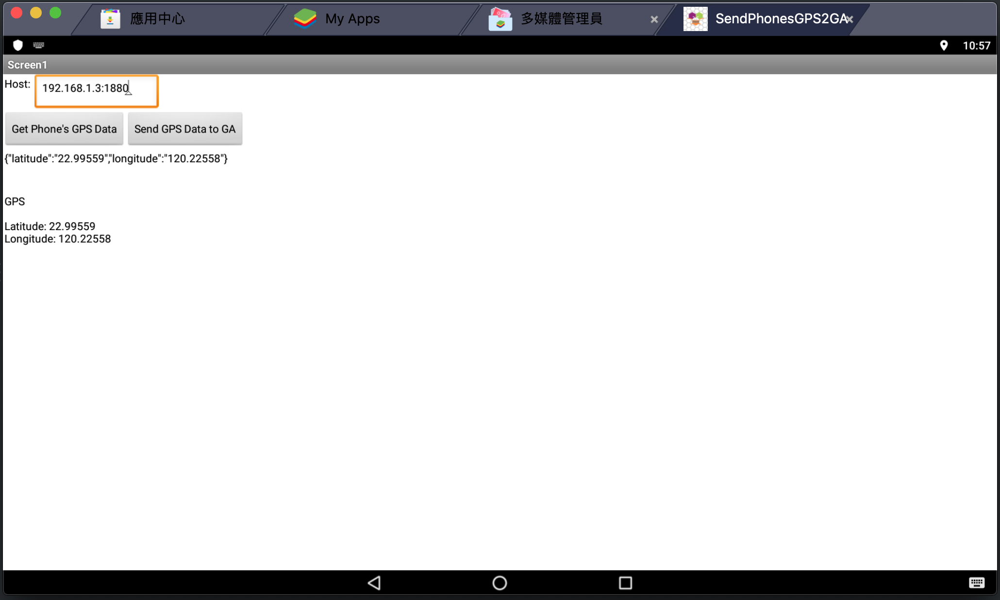
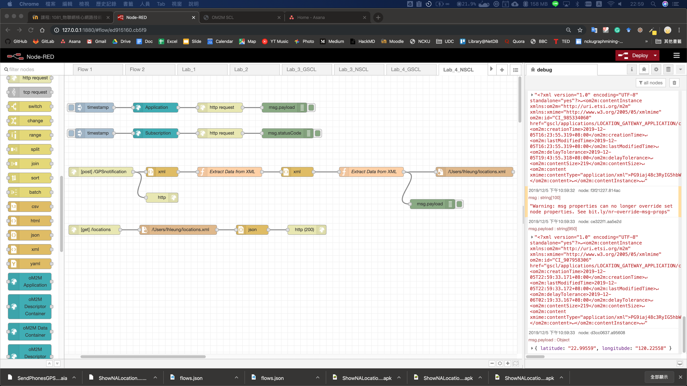
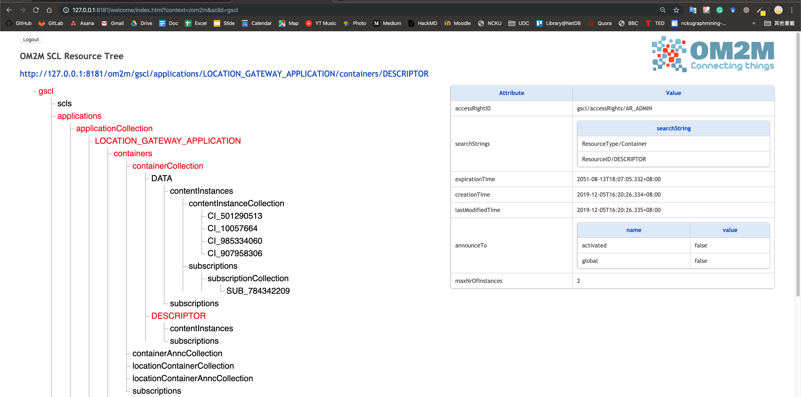
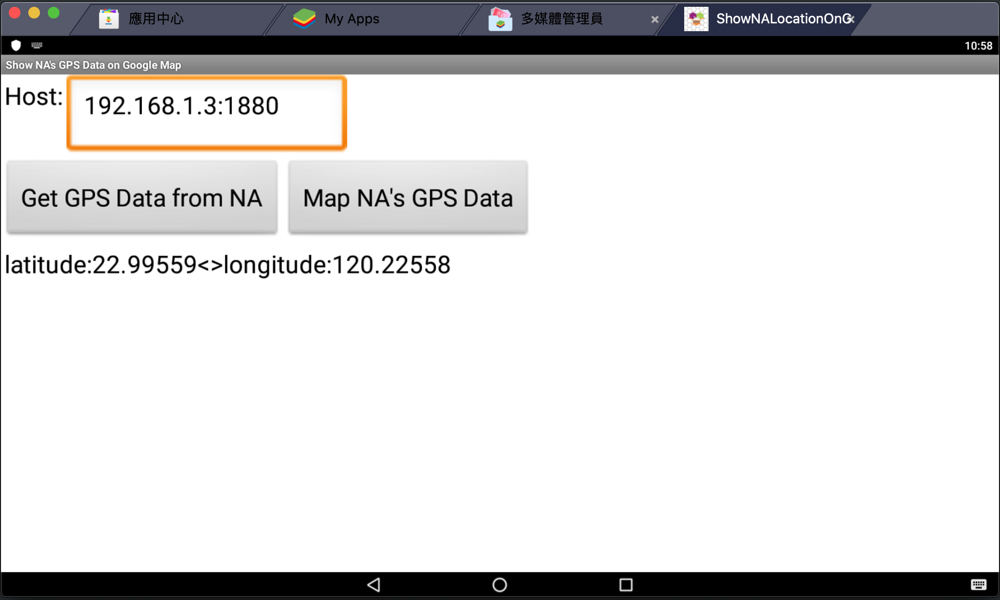
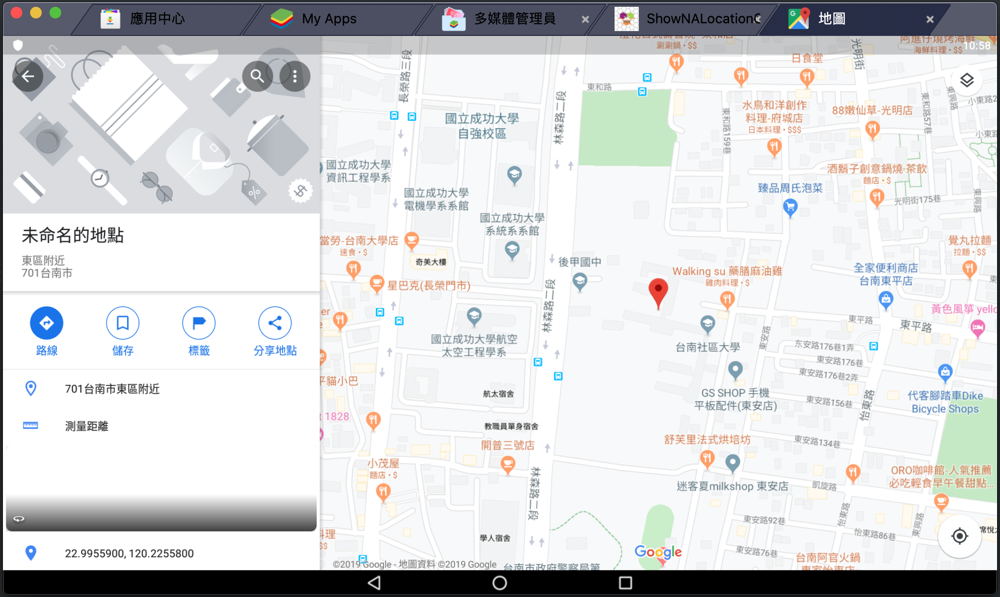

# LAB4 GA and NA with Node-red

P78081049 梁樂謙

## 檔案說明

* LAB4_GSCL_flows.json: GSCL 的 Node-red flow diagram

* LAB4_NSCL_flows.json: NSCL 的 Node-red flow diagram

* SendPhonesGPS2GA.aia: Send Phones GPS data to GA 的 App Inventor 2 graph

* ShowNALocationOnGoogleMap.aia: Show NA Location on Google Map 的 App Inventor 2 graph

## LAB-4.1 GA with Node-red

### LAB-4.1 目標

使用 node-red 分別建立以下:

1. Create a "Location_Gateway_Application" Application on OM2M
2. Create a "DESCRIPTOR" container on OM2M
3. Create a "DESCRIPTOR contentInsances" on OM2M
4. Create a "DATA" container on OM2M
5. Create a "DATA contentInsances" (for testing) on OM2M
6. Create a http node to forward data to GSCL

### LAB-4.1 步驟  

1. 依照 `LAB4.pdf` 的步驟執行

### LAB-4.1 結果

Node Red flow diagram

## LAB-4.2 inventor Sender

### LAB-4.2 目標

須完成兩個功能
1.讀取手機(or 模擬器)的location sensor
2.將其值交給 GA(node-red)

### LAB-4.2步驟

1. 依照 `LAB4.pdf` 的步驟執行

### LAB-4.2 結果

App

## LAB-4.3 NA with Node-red

### LAB-4.3 目標

使用 node-red 建立以下:

1. Create a "Location_Network_Application" Application on OM2M
2. Subscribe new contentInsatnace in the   gscl/Location_Gateway_Application/DATA  on OM2M and save recive notify
3. Create a http node to response previously save data

### LAB-4.3 步驟

1. 依照 `LAB4.pdf` 的步驟執行

### LAB-4.3 結果

Node-red flow diagram

GSCL

## LAB-4.4 APP Inventor reciver

### LAB-4.4 目標

須完成兩個功能:

1. http get NA(node-red) 上儲存的 data
2. 將該 data 用來啟動 google map 並顯示位子

### LAB-4.4 步驟

1. 依照 `LAB4.pdf` 的步驟執行

### LAB-4.4 結果

App

Google Map

