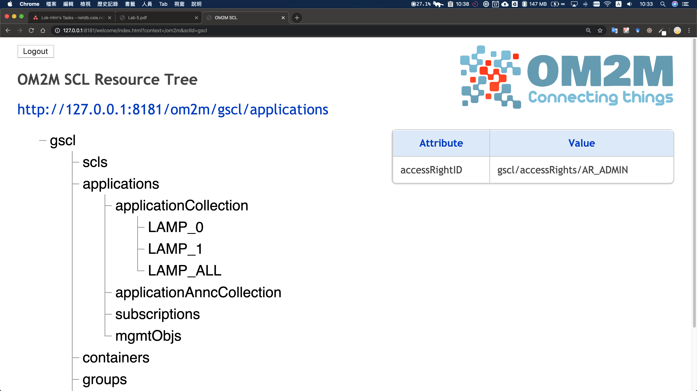
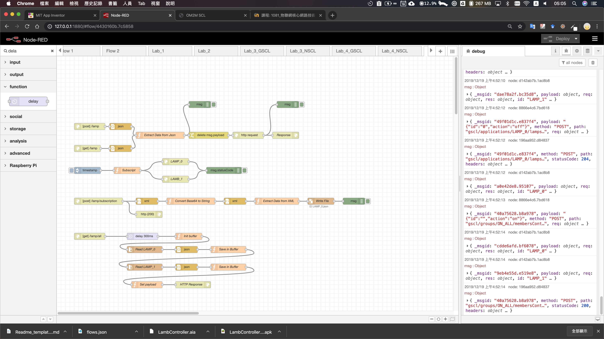
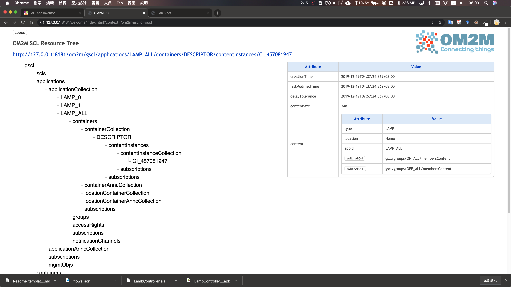
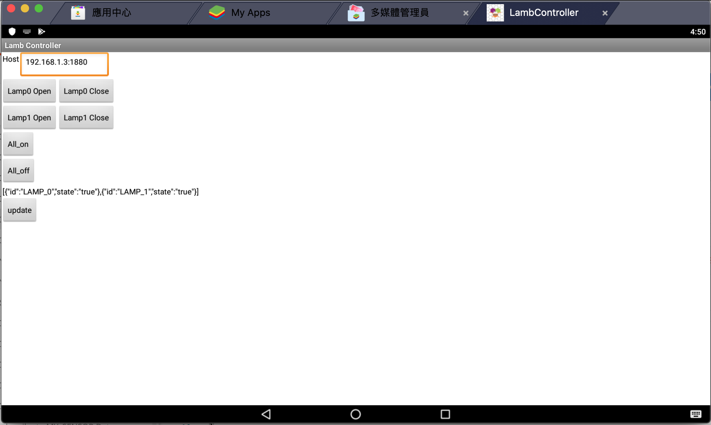
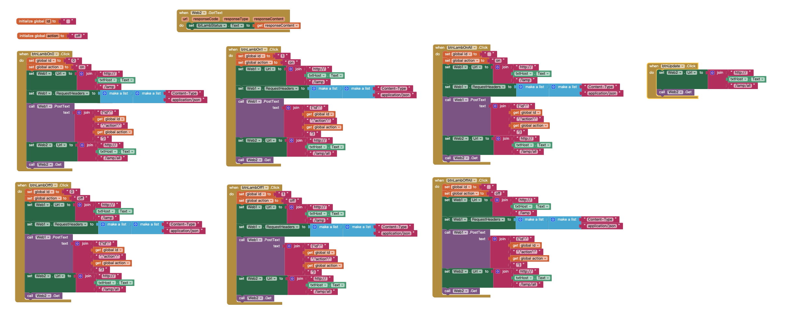

# LAB5 Lamp Controller

P78081049 梁樂謙

## 檔案說明

* LAB5_GSCL_flows.json: GSCL 的 Node-red flow diagram

* LambController.aia: App Invertor 2 diagram about lamp controller to switch on/off the lamb state and update

## LAB-5.1 GA with Node-red

## LAB-5.1 目標

使用任意方法完成以下:

1. 分別控制 LAMP_0 的開/關、LAMP_1 的開/關、ALL_ON、ALL_OFF 共六個動作

2. 在 APP 上，顯示當前燈泡的狀態 (主動 or 被動皆可)

## LAB-5.1 作法or步驟

1. 根據 `LAB_5.pdf` 的做法執行

2. 建立 GA endpoint 控制燈泡

    * Method: `POST`

    * Path: `/lamb`

    * Content-Type: application/json

    * Parameter

        * id(int): Lamb id, 0 or 1 in this lab, accept nullable for all lamb

        * action(string): Operation action of lamb ("on","off" or "")

    * 使用 `GET` 可取得單一個燈的狀態
    * 根據 `id` 和 `action` 改變呼叫的 URL，不需要使用 switch
    * 必需要刪除 `payload` ，否則為誤認為 `CREATE` method
    * `id` 為空，可控制所有電燈

3. 訂閱 Lamp Instance

4. 儲存變更狀態
    * 使用明文方式儲存在本機目錄
    * 根據電燈命名，分成不同文件，檔案格式為 `.json`，Pattern是 `<id>.json`
    * `subscription` 取得的內容為 `base64`，必需經過轉換

5. 取得目前所有電燈的狀態
    * 先延遲 300ms，確保文件已寫入
    * 遊走並讀取文件，並轉為成 json object
    * 不斷累加，最後回傳

## LAB-5.1 結果

Lamb Simulator

Node-Red flow diagram

GSCL interface

## LAB-5.2 Build lamp controller app

## LAB-5.2 作法or步驟

1. 設計界面

    a. 可供輸入動態的 Host

    b. 6 個不同按鈕

    c. 顯示狀態

    d. 更新按鈕

2. 設計邏輯

   a. 根據按鈕 Web_1 更改 `id` 和 `action`

   b. 送出 Web_1 和 Web_2

   c. 接收 Web_2 回傳資訊，更新狀態

## LAB-5.2 結果

Lamp Controller 使用界面

App Invertor 2 處理邏輯

